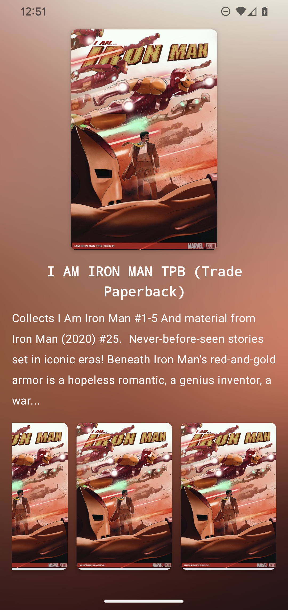
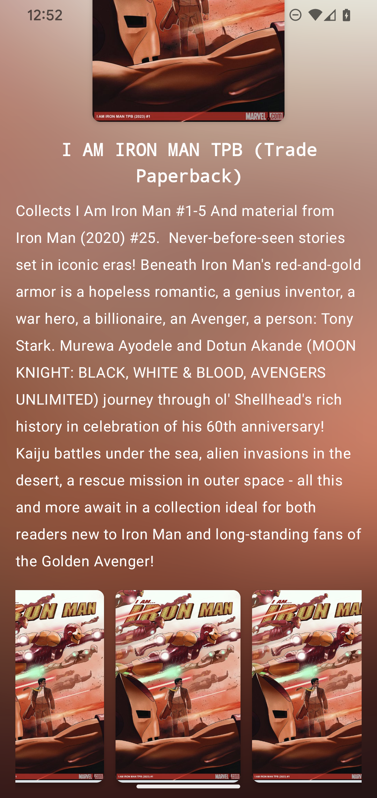
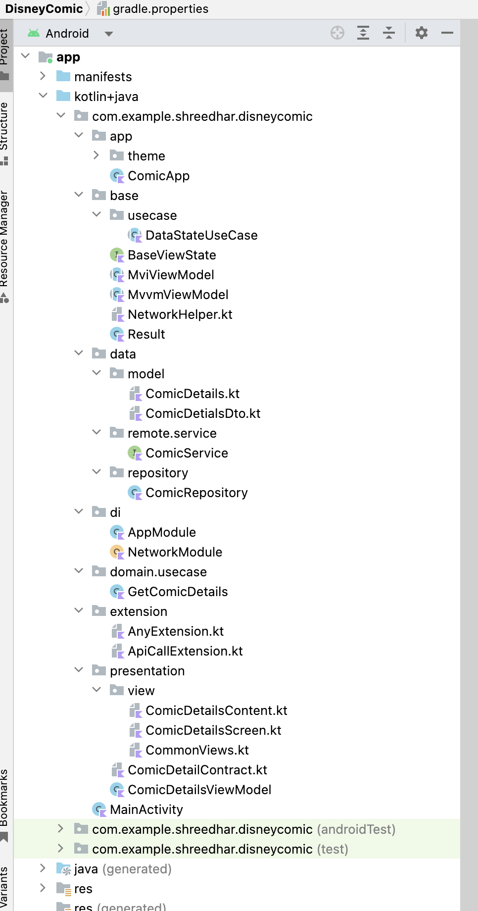
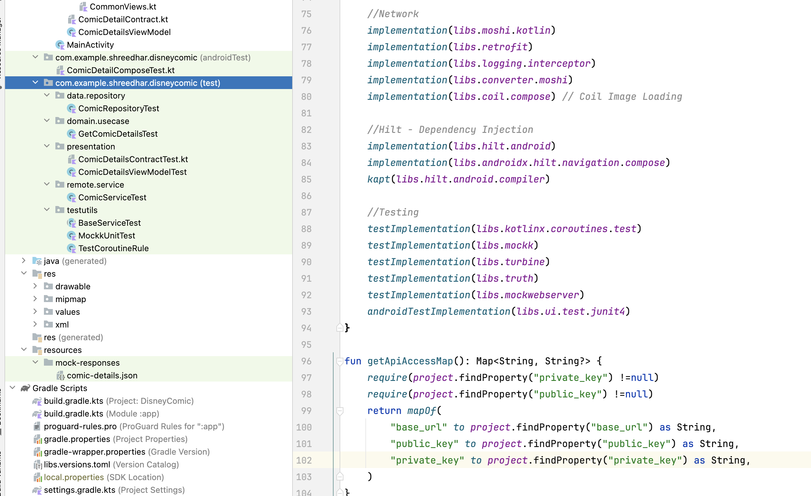

# Comic
A sample comic app illustrating Android development best practices.

### Implementation details
- Designed Comic Details Screen using Jetpack Compose. 
- Utilized MVI design pattern with Retrofit, Coroutines, Flow, and Hilt.
- Implemented unit tests, UI tests and used MockServer to test REST API.

### API Key

Developer keys required to make the network Api call should be provided in `~/.gradle/gradle.properties` file.

### Libraries Used
- Jetpack Compose
- Hilt
- Retrofit
- Coil
- Moshi
- MockK
- Mockserver
- Truth
- Compose UI testing

## Screenshots

